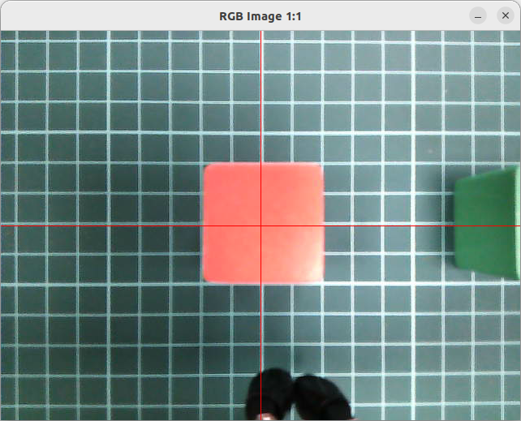
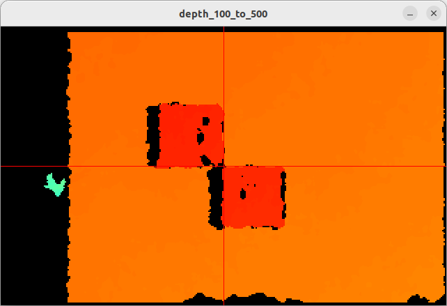
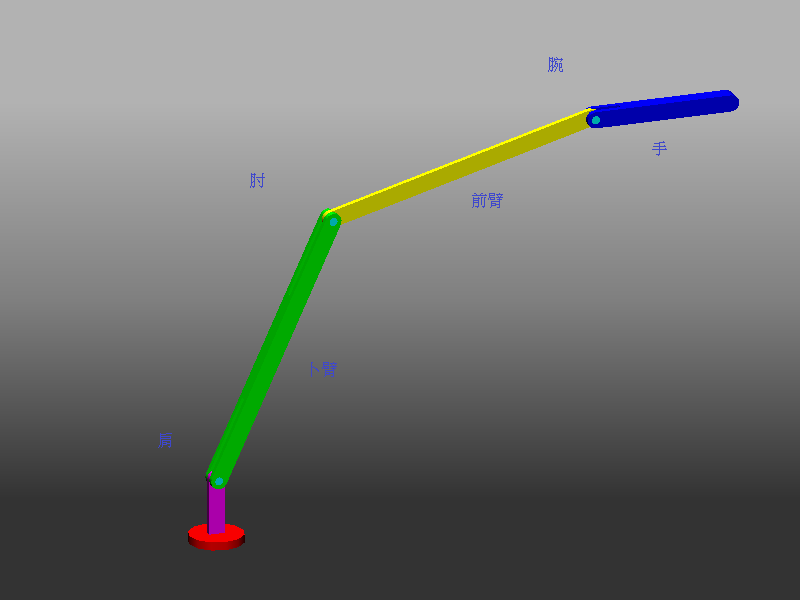
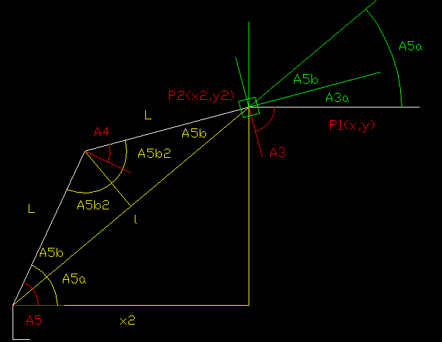
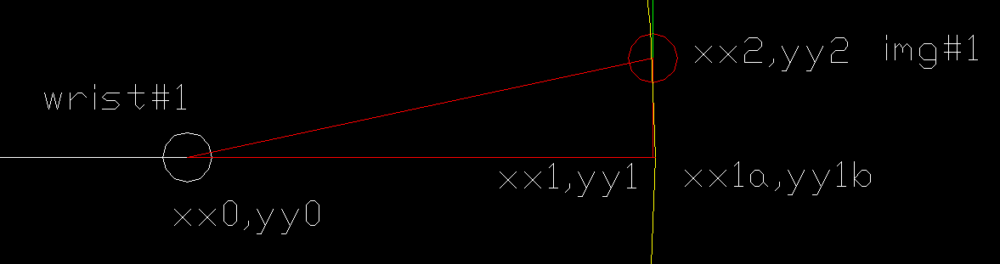
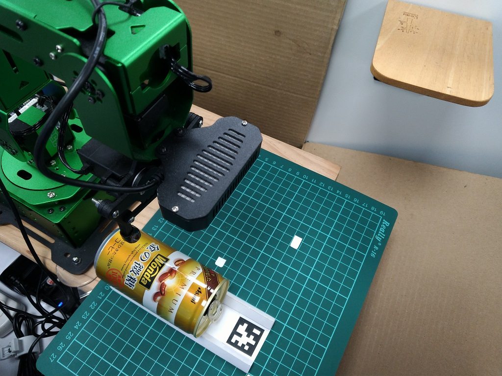

# jetARM
hiwonder jetARM study  
# 警告:程式可能導致手臂撞機的風險, 無法承擔風險的人請跳離
# 警告:程式可能導致手臂撞機的風險,使用時,手要放在電源開關上,異常時即時斷電  
### Completed on July 13, 2026
參考一招由天而降的掌法, 悟出由天而降的爪法, 避開了視角計算難題  
## 01 check shift of camera and claw, 10mm 47mm
[ex01](src/01/ex01.md) 
  
 
## 02 check shift of camera and claw, 20mm
目前沒用到,  
[ex02](src/02/02.md) 
  
 
## 03 絕對定位 數學基礎
src/03/簡單手臂的逆運動學2.pdf 
顧好腕的位置 
  
  
 
## 04 用命令行參數,操作手臂移動
校正姿勢 
腕的絕對定位 
腕的相對定位 
腕徑向伸長 
腕逆時針旋轉10mm 
舵機1,2,3,4,5,10操作 
爪子動作 
[ex04](src/04/04.md) 
## 07 影像中心與爪子的偏差
影像中心的xy移動 
 
[ex07](src/07/07.md) 

## 08 所見即所抓 April tag cube
[ex09](src/08/08.md) 
影片 
[[Video_1]](https://youtu.be/oylX-ZPG6js)
  

## 09 抓罐子
[ex08](src/09/09.md) 
 
影片 
[[Video_1]](https://youtu.be/oylX-ZPG6js)
  
