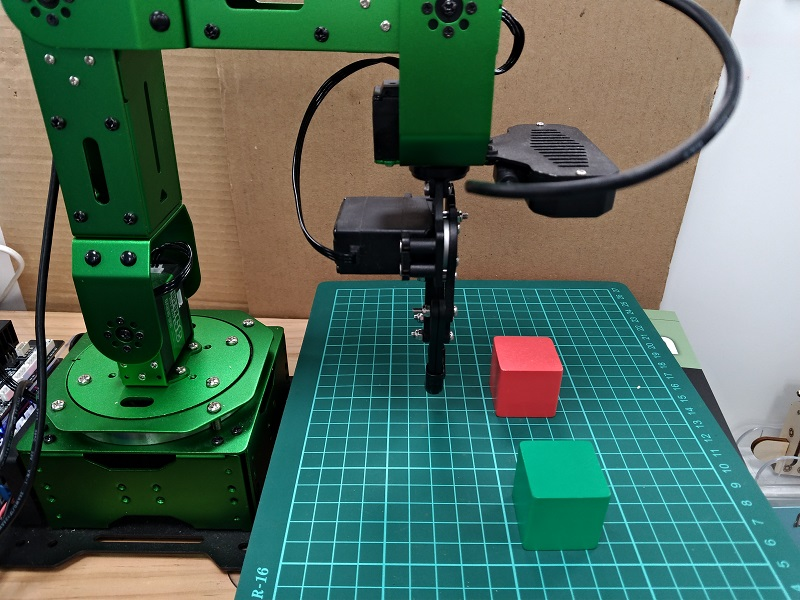
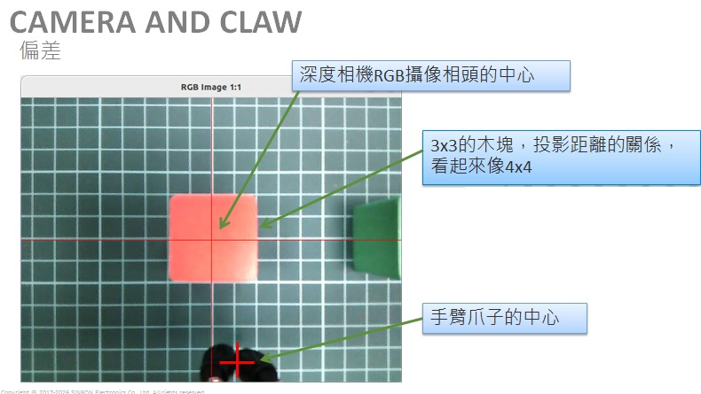
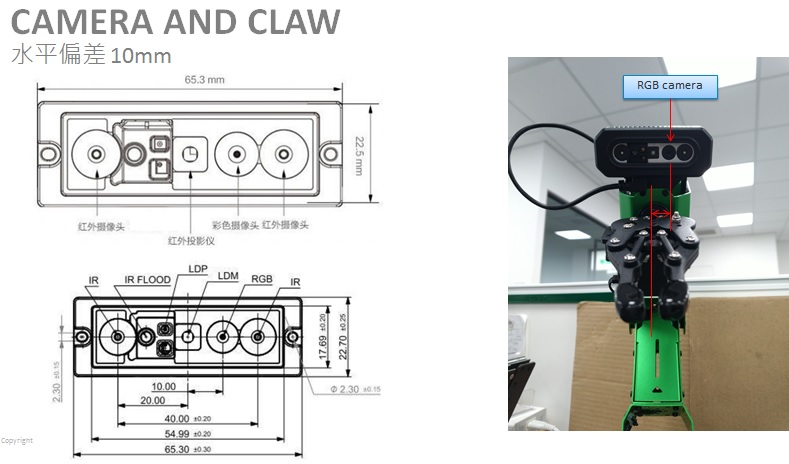
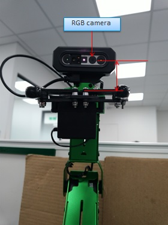

# shift of camera and claw
  
 
## test posture
 
run posture_door.sh to adjest the posture of arm. 

  
 
  
 
  
 
  
 
need  
sudo systemctl restart start_app_node.service  
or  
sh .stop_ros.sh  
ros2 launch peripherals depth_camera.launch.py  
