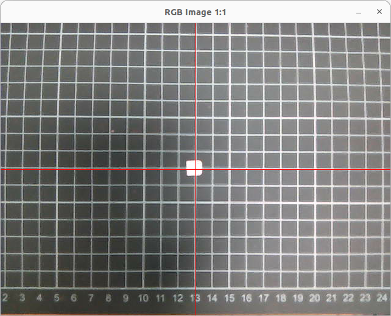

# 04 用命令行參數,操作手臂移動
執行 
python sub6c.py 
 
放上參考用的坐標 
再用pub5.py 
## 100 校正姿勢
python pub5.py "100 0 0 0" 
手臂會伸直,若有偏移,在params.py調整 
servo1_shift 
servo2_shift 
servo3_shift 
servo4_shift 
servo5_shift 
## 0 腕的絕對定位
腕回零點 
python pub5.py "0 0 0 0"  
Z腕回向上10mm 
python pub5.py "0 0 0 10"  
X腕回向前10mm 
Ypython pub5.py "0 10 0 0"  
腕回向左10mm 
python pub5.py "0 10 10 0"  
## 20 腕的相對定位
Z腕回向上增加10mm 
python pub5.py "20 0 0 10"  
X腕回向前增加10mm 
python pub5.py "20 10 0 0"  
Y腕回向左增加10mm 
python pub5.py "20 0 10 0"  
## 30 腕徑向相對伸長
腕往徑向伸長xx mm,修正RGB影像與爪子的徑向偏移 
python pub5.py "30 xx 0 0"  
## 40 腕逆時針旋轉相對10mm
腕順時針旋轉10 mm,修正RGB影像與爪子的垂直徑向的偏移, 並補正舵機#5因為這個動作導致的偏差 
xx : 現在腕在xy平面的角度 
python pub5.py "40 xx 0 0" 
## 舵機1,2,3,4,5,10操作
舵機1逆時針轉到10度 
python pub5.py "1 10 0 0"  
肩,舵機2逆時針轉到10度 
python pub5.py "2 10 0 0"  
肘,舵機3逆時針轉到-85度 
python pub5.py "3 -85 0 0"  
腕,舵機4逆時針轉到-85度 
python pub5.py "4 -85 0 0"  
腕,舵機5順時針轉到10度 
python pub5.py "5 10 0 0"  
爪,舵機10順時針轉到0度, pluse=~541 
python pub5.py "10 0 0 0"  
## 爪子動作
爪子開,改參數claw_open 
python pub5.py "11 0 0 0"  
爪子抓30mm木塊,,改參數claw_3cm 
python pub5.py "12 0 0 0"  
爪子閉,用於計算圖片中與爪子中心的偏差,改參數claw_close 
python pub5.py "12 0 0 0"  
