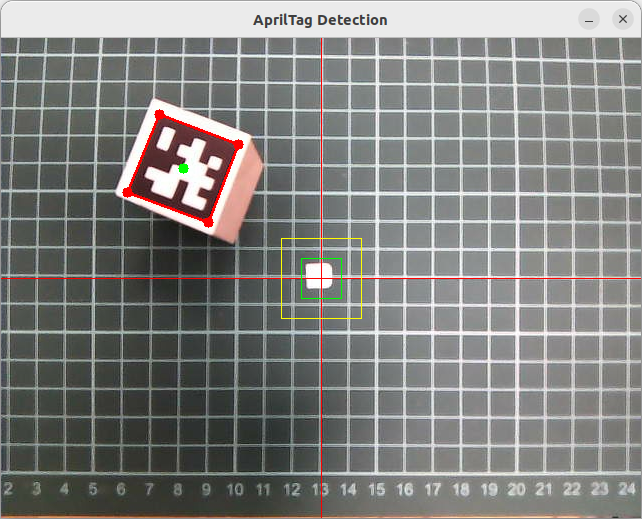

# 05 抓取有April tag的木塊
# 1 鏡頭中心對準木塊中心 
先以遠距對準木塊中心, 再下降40mm, 再做一次對準中心,消除舵機的誤差 
cub1_find_atag2.sh 
## 手動模式 
### 1.抓圖存1.jpg 
python get_pic1.py  
### 2.圖片中找april tag 
python find_at6.py 
RGB影像中心與april tag中心距離遠,移動較長,參數move_long 
RGB影像中心與april tag中心距離近,移動較短,參數move_short 
一開始是米字移動,之後再上下/左右移動 
簡單決策後,產生st_argv_for_arm.txt 與 atag_pm45.txt,是給pub5.py用的參數 
 
# 2 爪子抓木塊 
徑向伸長45mm,再逆向轉10mm,修正RGB影像與爪子的偏差 
