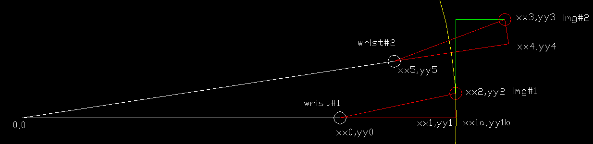

# 07 影像中心與爪子的偏差47mm, 10mm
影像中心由img#1=(xx3,yy3)到了img#2=(xx3,yy3)時,腕座標wrist#2是多少 
  
 
影像中心歸零後, img#1=(xx2,yy2) 
腕在wrist#1=(xx0,yy0)
腕座標wrist#1徑向外移47mm到(xx1,yy1),再套如下公式逆時針轉10mm,腕就會到img#2=(xx2,yy2) 
cw1 = 2 * math.asin(( 10 / 2) / len(xx1,yy1)) 
  
有人會注意到, (xx1,yy1)!=(xx1a,yy1b) 
(xx1,yy1)與(xx1a,yy1b)的間距很小,略過可以簡化計算,不然要計算點到圓的切點.再從兩個解取一個正確的解 
 
若影像中心要到img#2=(xx3,yy3),腕座標wrist#2是多少 
(xx2,yy2)代入已知條件獲得(xx3,yy3),順時針轉10mm到(xx4,yy4),再徑向內移47mm到(xx5,yy5),影像中心就會在img#2=(xx3,yy3) 
實作時,腕會由wrist#1=(xx0,yy0)直接到wrist#2=(xx5,yy5) 
物理世界不會繞行(xx1,yy1),(xx2,yy2),(xx3,yy3),(xx4,yy4) 
