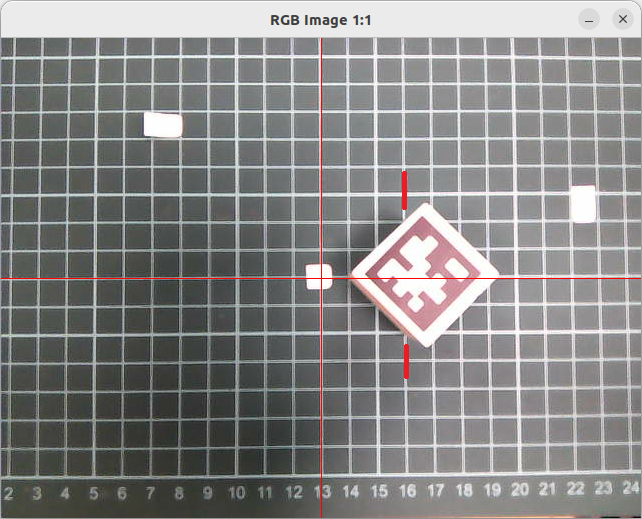
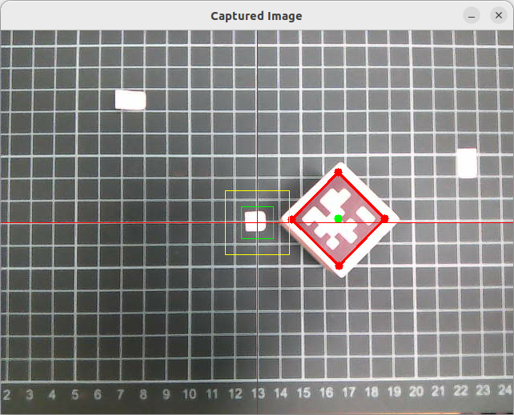
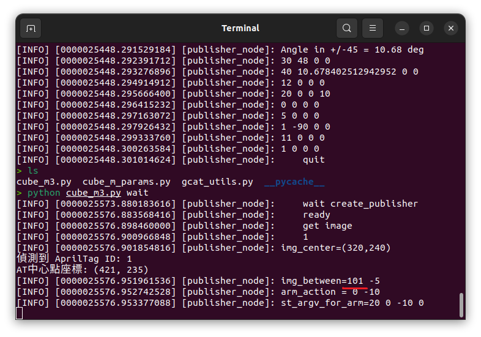

# 所見即所抓
## 使用方法
將貼有april tag的木塊放在可視區, 執行 
python cube_m3.py 
jetARM就會找有april tag的木塊,抓取,右轉90度,放下木塊,歸零. 
## 參數 pixels_per_30mm怎麼來的 ?
將jetARM歸零,放上方格板,將木塊放在30mm的位置,執行 
python cube_m3.py wait 
  
  
  