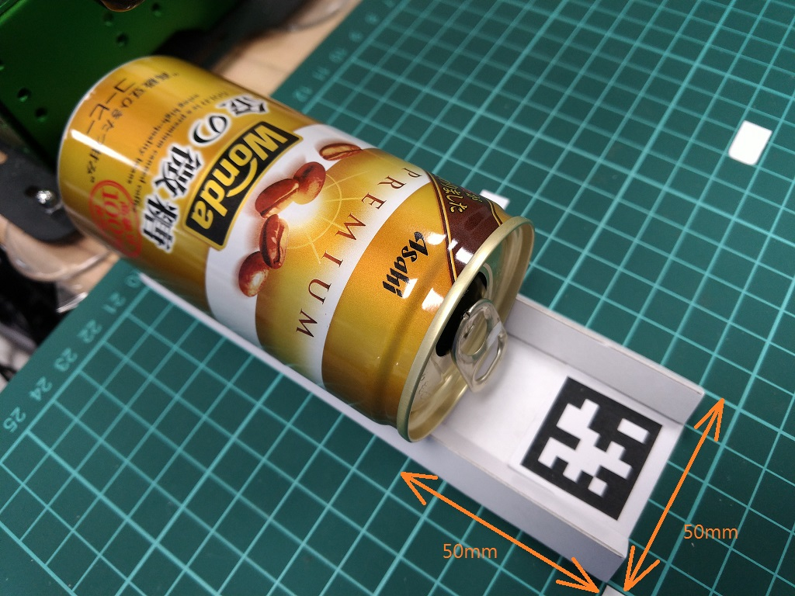
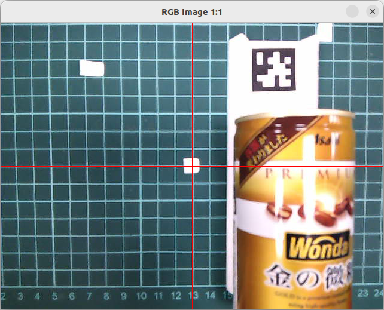

# 09 抓罐子
 
 
 
罐子要保持與X軸平行, 就可以抓得到. 
罐子直徑約52mm, 罐子高約105mm  
 

# 新加指令
## 14 爪子抓罐子
python pub5.py "14 0 0 0"  

## 50 以影像的中心, 移動 dx dy
目前的主要移動的方式都是以腕當中心,腕水平垂直移動,影像的中心看到的會有偏差.  
這個指命補正了攝影機與腕的偏差, 讓影像的中心可以垂直水平移動
python pub5.py "50 dx dy 0"  

## 60 腕移動 dx dy dz, 並保持爪水平
python pub5.py "60 dx dy dz"  

## 61 腕移動 dx dy dz, 並保持爪垂直
python pub5.py "61 dx dy dz"  

## 70 轉動爪與y軸保持水平
### 用於抓平行X宜的物品
python pub5.py "70 0 0 0"  

## 80 以影像中心為原點,將腕移動到 dx dy dz
python pub5.py "80 dx dy dz"  
